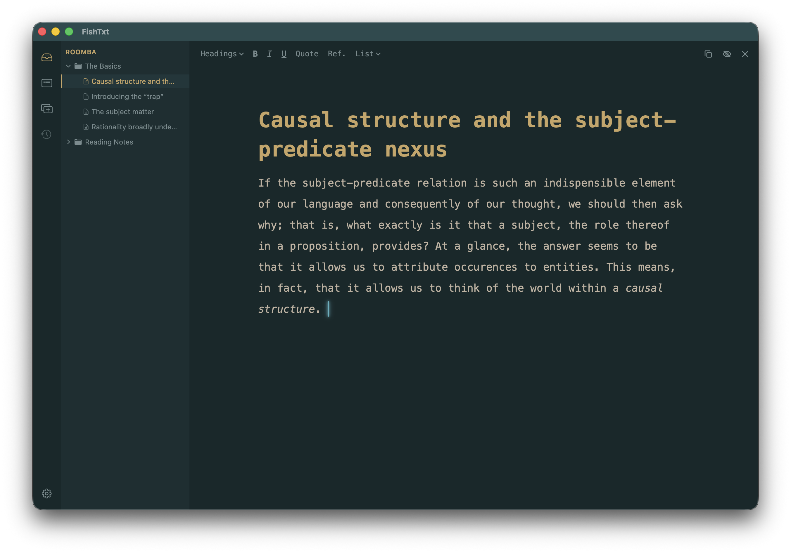

# FishTxt

> A rich text editor for rapid brainstorming and longer drafts.

## Purpose

FishTxt is a hybrid between a notetaking app and a conventional word document. It is a light-weight rich text editor that supports two distinct kinds of work in a single environment:

1. Rapid brainstorming, piece-wise drafting, and jumping between ideas
2. Careful organization of drafts, and longer sessions of focused writing.

When writing a long article that covers many sources and topics, it is hard to keep everything coherent in a single word document right from the start. Conversely, it is hard to develop a holistic vision only through a form of notetaking, whether it be in a physical notebook, a dedicated notes app, or — the worst but perhaps the simplest — another word document where you just throw everything in. Thus, most people require some combination of the two kinds of tools.

FishTxt was designed to be exactly that kind of combination: a set of tools that you can use from the very beginning of a project all the way to the first or second draft. Of course, you'll likely need at some point an actual, robust document editor like Microsoft Word or Apple Pages. While FishTxt can export to a printer or PDF, this is done through built-in CSS profiles, which is quite different from document editors if that's what you're used to. But remember, FishTxt was designed specifically for the development phase, for longer projects, for the part of your work where it's still unclear what the finished product should really look like. In that regard, FishTxt is not intended to replace your document editor; but it does make you rethink what each tool is best used for.

## Screenshot

**Main Editor** (shown in the default `morning seafoam` color palette):

## Credits

The app was designed by June Jung, and the codebase was vibe-coded with Claude by Anthropic.

Much of FishTxt has been written from scratch as a native macOS application, but the actual text editor uses [TipTap](https://tiptap.dev/docs/editor/getting-started/overview), an open-source rich text editor framework. Moreover, the [tiptap-footnoes](https://github.com/buttondown/tiptap-footnotes) extension is used for adding in-line references and notes. The editor runs in a javascript environment that is wrapped inside the app through Apple's `WKWebView` library.

## Install, First Launch, and Walkthrough

Current version packaged: Beta (4).

A macOS `.app` file is available in the `Application (Beta)/` folder. You'll have to uncompress (unzip) the file. I recommend moving this into your `Applications` folder.

When launching the app for the first time, FishTxt will have a "Welcome" project. This is an example project directory — which functions like any other FishTxt project that a user creates for their own use — and will guide you through the major features of the app. You can safely delete or archive this, if you want, after having been walked through.

## File Persistence

Project files are stored in `~/Documents/FishTxt/`, and user settings are stored through `@AppStorage`.
